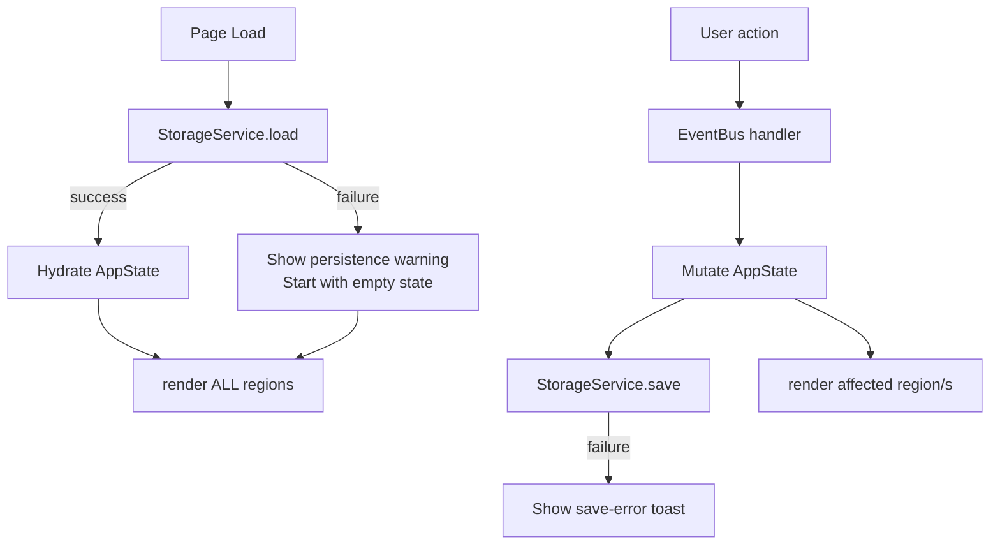

# Design Document — Expense & Budget Visualizer

## Overview

The Expense & Budget Visualizer is a zero-dependency, client-side web application delivered as a single HTML file. It runs directly from the `file://` protocol in any modern browser with no build step. All state lives in the browser's `localStorage`; there is no backend.

The application renders four primary UI regions: a summary bar (balance), an add-transaction form, a spending chart (Canvas 2D), and a transaction list. Alongside these, two management panels handle custom categories and per-category spending limits. A single in-memory `AppState` object is the sole source of truth; every mutation synchronizes that state to `localStorage` and triggers a targeted re-render of the affected UI region.

### Design Goals

- Keep the entire logic surface in **one JavaScript file** (`js/app.js`) using the module pattern to avoid polluting the global scope.
- Minimize DOM manipulation overhead by re-rendering only the region that changed, not the full page.
- Use **event delegation** at the container level so dynamically inserted list items never need individual listeners.
- Provide a **graceful degradation path** when `localStorage` is unavailable.

---

## Architecture

### High-Level Flow



### Module Breakdown

| Module | Responsibility |
|---|---|
| `StorageService` | Wraps `localStorage` read/write; catches and surfaces errors |
| `AppState` | Single mutable object holding all runtime data; never written directly — always through mutation helpers |
| `Validators` | Pure functions for form field validation |
| `SortService` | Pure functions that sort a transaction array by the chosen criterion |
| `ChartRenderer` | Canvas 2D drawing for the pie/doughnut chart and legend |
| `SpendingService` | Calculates per-category monthly totals; compares against limits |
| UI render functions (`renderBalance`, `renderTransactionList`, `renderChart`, `renderCategories`, `renderLimits`) | DOM-diffing-free targeted re-renders |
| Event handlers (registered once at startup) | Delegate click/change/submit events; call mutators and renderers |

---

## File & Folder Structure

```
index.html
css/
  styles.css
js/
  app.js
```

`index.html` links to `css/styles.css` in `<head>` and loads `js/app.js` as a deferred `<script>` before `</body>`. No other files are needed.

### `index.html` Skeleton

```html
<!DOCTYPE html>
<html lang="en">
<head>
  <meta charset="UTF-8">
  <meta name="viewport" content="width=device-width, initial-scale=1.0">
  <title>Expense & Budget Visualizer</title>
  <link rel="stylesheet" href="css/styles.css">
</head>
<body>
  <!-- #summary: balance display -->
  <header id="summary">…</header>

  <!-- #chart-section: canvas + legend -->
  <section id="chart-section">…</section>

  <!-- #transaction-section: sort controls + list -->
  <section id="transaction-section">…</section>

  <!-- #form-section: add-transaction form -->
  <section id="form-section">…</section>

  <!-- #category-section: custom category manager -->
  <section id="category-section">…</section>

  <!-- #limit-section: spending limit manager -->
  <section id="limit-section">…</section>

  <!-- #toast: non-blocking error messages -->
  <div id="toast" role="status" aria-live="polite"></div>

  <script src="js/app.js" defer></script>
</body>
</html>
```

---

## Components and Interfaces

### 1 — Header / Balance (`#summary`)

Displays the running balance with currency symbol and two decimal places. Re-rendered by `renderBalance()` after any transaction add or delete.

**DOM target:** `#balance-amount` (a `<span>` inside `#summary`)

**Rendered output example:** `$1,234.56` or `$0.00`

---

### 2 — Add Transaction Form (`#form-section`)

A `<form id="add-form">` with five fields:

| Field | Type | Constraint |
|---|---|---|
| `title` | `<input type="text">` | Required, max 100 chars |
| `amount` | `<input type="number">` | Required, > 0, ≤ 999,999,999.99 |
| `date` | `<input type="date">` | Required |
| `category` | `<select>` | Required, populated from `AppState.categories` |
| `type` | `<select>` or radio | Required, values: `income` / `expense` |

Inline validation messages are rendered as `<span class="field-error">` siblings of each input. The form triggers `handleAddTransaction()` on `submit`.

---

### 3 — Sort Controls (`#sort-controls` inside `#transaction-section`)

A set of `<button>` elements or a `<select>` mapped to four sort values:
- `amount-desc` (default)
- `amount-asc`
- `category-asc`
- `category-desc`

Triggers `handleSortChange(value)` which updates `AppState.sortOrder` and calls `renderTransactionList()`.

---

### 4 — Transaction List (`#transaction-list` inside `#transaction-section`)

An unordered list `<ul id="transaction-list">` where each `<li>` has:
- CSS class `income` or `expense`
- `data-id` attribute holding the transaction UUID
- Text content: title, signed amount (`+` / `−`), date, category
- A delete button (`<button class="btn-delete" data-id="…">`) handled via delegation

Categories that exceed their monthly spending limit receive an additional CSS class `over-limit` on their `<li>` elements.

Empty state: when `AppState.transactions` is empty, renders a single `<li class="empty-state">` message.

---

### 5 — Chart (`#chart-section`)

A `<canvas id="spending-chart">` with a `<div id="chart-legend">` below (or beside) it. Rendered entirely by `ChartRenderer`.

- On screens < 600 px: stacked (canvas on top, legend below).
- On screens ≥ 600 px: legend floats to the right of the canvas.

Empty state: canvas is hidden; a `<p id="chart-empty">` message is shown instead.

---

### 6 — Category Manager (`#category-section`)

An `<input type="text" id="new-category-input">` plus an `<button id="add-category-btn">`. Below it, a read-only `<ul id="category-list">` listing all categories (predefined + custom). Predefined categories are not deletable.

---

### 7 — Spending Limit Manager (`#limit-section`)

A `<select id="limit-category-select">` listing all categories, a `<input type="number" id="limit-amount-input">`, a save button, and a clear button. Below it, a summary table `<table id="limits-table">` showing each category with its current limit (or "—").

---

## Data Models

All data is serialized as JSON and stored under three `localStorage` keys:

| Key | Type | Description |
|---|---|---|
| `ebv_transactions` | `Transaction[]` | All recorded transactions |
| `ebv_categories` | `Category[]` | All categories (predefined + custom) |
| `ebv_limits` | `SpendingLimit[]` | Per-category limits |

### Transaction

```js
/**
 * @typedef {Object} Transaction
 * @property {string}  id        - UUID v4, e.g. "a1b2c3d4-…"
 * @property {string}  title     - Max 100 characters
 * @property {number}  amount    - Positive number, 0.01–999999999.99
 * @property {string}  date      - ISO 8601 date string "YYYY-MM-DD"
 * @property {string}  category  - Category name (must exist in AppState.categories)
 * @property {'income'|'expense'} type
 */
```

### Category

```js
/**
 * @typedef {Object} Category
 * @property {string}  name        - Unique (case-insensitive), max 50 chars
 * @property {boolean} isPredefined - true for built-in categories; cannot be deleted
 */
```

Predefined categories loaded at first run: `["Food", "Transport", "Health", "Entertainment", "Other"]`

### SpendingLimit

```js
/**
 * @typedef {Object} SpendingLimit
 * @property {string} category  - Must match a Category name
 * @property {number} limit     - Positive number, 0.01–999999999.99
 */
```

### AppState (in-memory only)

```js
const AppState = {
  transactions:  [],   // Transaction[]
  categories:    [],   // Category[]
  limits:        [],   // SpendingLimit[]
  sortOrder: 'amount-desc',   // current sort selection
};
```

`AppState` is never written to `localStorage` directly. Three helper functions manage persistence:

```js
function saveTransactions()  { StorageService.write('ebv_transactions', AppState.transactions); }
function saveCategories()    { StorageService.write('ebv_categories',   AppState.categories);   }
function saveLimits()        { StorageService.write('ebv_limits',       AppState.limits);       }
```

### UUID Generation

```js
function generateId() {
  // Uses crypto.randomUUID() when available; falls back to Math.random()-based UUID
  return (typeof crypto !== 'undefined' && crypto.randomUUID)
    ? crypto.randomUUID()
    : 'xxxxxxxx-xxxx-4xxx-yxxx-xxxxxxxxxxxx'.replace(/[xy]/g, c => {
        const r = Math.random() * 16 | 0;
        return (c === 'x' ? r : (r & 0x3 | 0x8)).toString(16);
      });
}
```

---

## State Management Approach

A single `AppState` object serves as the runtime source of truth. The lifecycle of every mutation follows the same pattern:

```
User event → validate → mutate AppState → persist to localStorage → re-render affected region
```

No global variables outside `AppState`; all functions are defined inside an IIFE or ES-module-style block to avoid namespace collisions.

**Mutation helpers (examples):**

```js
function addTransaction(tx) {
  AppState.transactions.unshift(tx);       // newest first
  saveTransactions();
  renderBalance();
  renderTransactionList();
  renderChart();
}

function deleteTransaction(id) {
  AppState.transactions = AppState.transactions.filter(t => t.id !== id);
  saveTransactions();
  renderBalance();
  renderTransactionList();
  renderChart();
}

function addCategory(name) {
  AppState.categories.push({ name, isPredefined: false });
  saveCategories();
  renderCategories();
  // Refresh category <select> in the add-transaction form
  refreshCategorySelect();
}

function setLimit(category, limit) {
  const existing = AppState.limits.find(l => l.category === category);
  if (existing) existing.limit = limit;
  else AppState.limits.push({ category, limit });
  saveLimits();
  renderTransactionList();   // re-evaluate over-limit classes
  renderChart();
  renderLimits();
}
```

---

## Chart Rendering Strategy

The chart is a **doughnut chart** drawn with the Canvas 2D API. No external library is used.

### Algorithm

```
1. Filter AppState.transactions to type === 'expense'
2. Aggregate totals per category → Map<categoryName, totalAmount>
3. Sort entries by totalAmount descending
4. If entries.length > 10, keep top 10 and sum the rest into "Other"
5. Calculate total = sum of all amounts
6. Assign a color from a fixed palette of 11 distinct colors (index 10 reserved for "Other")
7. Draw arc segments:
   - startAngle tracks the cumulative angle
   - segmentAngle = (categoryTotal / total) * 2π
   - ctx.arc(cx, cy, outerRadius, startAngle, startAngle + segmentAngle)
   - ctx.arc(cx, cy, innerRadius, ...) in reverse → doughnut hole
8. Draw legend entries: colored swatch + category name + formatted amount
```

### Canvas Setup

```js
const CHART_SIZE = 240;   // px, square canvas
const OUTER_RADIUS = 100;
const INNER_RADIUS = 55;   // doughnut hole

function renderChart() {
  const canvas = document.getElementById('spending-chart');
  const expenses = aggregateExpenses();   // returns sorted array

  if (expenses.length === 0) {
    canvas.style.display = 'none';
    document.getElementById('chart-empty').style.display = '';
    document.getElementById('chart-legend').innerHTML = '';
    return;
  }

  canvas.style.display = '';
  document.getElementById('chart-empty').style.display = 'none';

  canvas.width  = CHART_SIZE;
  canvas.height = CHART_SIZE;
  const ctx = canvas.getContext('2d');
  ctx.clearRect(0, 0, CHART_SIZE, CHART_SIZE);

  const cx = CHART_SIZE / 2, cy = CHART_SIZE / 2;
  let startAngle = -Math.PI / 2;   // start at 12 o'clock

  const total = expenses.reduce((s, e) => s + e.amount, 0);
  const palette = CHART_COLORS;   // 11-color constant array

  expenses.forEach((entry, i) => {
    const sweep = (entry.amount / total) * 2 * Math.PI;
    ctx.beginPath();
    ctx.moveTo(cx, cy);
    ctx.arc(cx, cy, OUTER_RADIUS, startAngle, startAngle + sweep);
    ctx.arc(cx, cy, INNER_RADIUS, startAngle + sweep, startAngle, true);
    ctx.closePath();
    ctx.fillStyle = palette[i];
    ctx.fill();
    startAngle += sweep;
  });

  renderLegend(expenses, palette, total);
}
```

### Color Palette

```js
const CHART_COLORS = [
  '#4e79a7','#f28e2b','#e15759','#76b7b2',
  '#59a14f','#edc948','#b07aa1','#ff9da7',
  '#9c755f','#bab0ac','#aaaaaa'   // index 10 = "Other"
];
```

### Category Warning Highlight in Chart

When a category exceeds its monthly limit, its arc segment is outlined with a `2px` stroke in the warning color (`#e74c3c`) and a warning icon (⚠) is appended to its legend entry.

---

## Event Handling Architecture

All event listeners are registered **once** in the `init()` function using **event delegation** on stable container elements. Dynamic content (list items, table rows) never gets its own listeners.

```js
function init() {
  // Add-transaction form
  document.getElementById('add-form')
    .addEventListener('submit', handleAddTransaction);

  // Delete buttons delegated to the list container
  document.getElementById('transaction-list')
    .addEventListener('click', e => {
      if (e.target.closest('.btn-delete')) {
        handleDeleteTransaction(e.target.closest('.btn-delete').dataset.id);
      }
    });

  // Sort controls
  document.getElementById('sort-controls')
    .addEventListener('change', e => handleSortChange(e.target.value));

  // Category manager
  document.getElementById('add-category-btn')
    .addEventListener('click', handleAddCategory);

  // Spending limit manager
  document.getElementById('save-limit-btn')
    .addEventListener('click', handleSetLimit);
  document.getElementById('clear-limit-btn')
    .addEventListener('click', handleClearLimit);
}
```

### Handler Responsibilities

| Handler | Actions taken |
|---|---|
| `handleAddTransaction(e)` | `e.preventDefault()` → validate → build `Transaction` object → `addTransaction()` → clear form |
| `handleDeleteTransaction(id)` | Confirm (optional) → `deleteTransaction(id)` |
| `handleSortChange(value)` | `AppState.sortOrder = value` → `renderTransactionList()` |
| `handleAddCategory()` | Validate name → `addCategory(name)` → clear input |
| `handleSetLimit()` | Validate → `setLimit(category, limit)` → clear input |
| `handleClearLimit()` | `removeLimit(category)` |

---

## Responsive Layout Strategy

Layout uses **CSS custom properties**, **Flexbox**, and a single `@media` breakpoint at `600px`.

### CSS Custom Properties (defined on `:root`)

```css
:root {
  --color-income:    #27ae60;
  --color-expense:   #e74c3c;
  --color-warning:   #e74c3c;
  --color-bg:        #f5f5f5;
  --color-surface:   #ffffff;
  --color-text:      #2c3e50;
  --color-muted:     #7f8c8d;
  --radius:          8px;
  --spacing-sm:      8px;
  --spacing-md:      16px;
  --spacing-lg:      24px;
  --min-touch:       44px;   /* minimum touch target */
  --font-base:       1rem;
}
```

### Mobile-First Base Layout (< 600 px)

```css
body {
  display: flex;
  flex-direction: column;
  gap: var(--spacing-md);
  padding: var(--spacing-md);
  max-width: 100%;
  overflow-x: hidden;
}

/* Section order: summary → chart → transaction list (via order property) */
#summary            { order: 1; }
#chart-section      { order: 2; }
#transaction-section{ order: 3; }
#form-section       { order: 4; }
#category-section   { order: 5; }
#limit-section      { order: 6; }
```

### Desktop Adaptation (≥ 600 px)

```css
@media (min-width: 600px) {
  body {
    display: grid;
    grid-template-columns: 1fr 1fr;
    grid-template-rows: auto;
    column-gap: var(--spacing-lg);
  }

  #summary              { grid-column: 1 / -1; }   /* full width */
  #chart-section        { grid-column: 1; }         /* ~50% width */
  #transaction-section  { grid-column: 2; }         /* ~50% width */
  #form-section         { grid-column: 1; }
  #category-section     { grid-column: 2; }
  #limit-section        { grid-column: 1 / -1; }
}
```

The chart and transaction list columns each occupy roughly 50% of the available width (satisfying the 40%–60% requirement).

### Touch Targets

```css
button, input, select {
  min-height: var(--min-touch);
  min-width: var(--min-touch);
  box-sizing: border-box;
}
```

### 320 px Safeguards

```css
* { box-sizing: border-box; }
img, canvas { max-width: 100%; }

/* Text truncation for long titles in list items */
.transaction-title {
  white-space: nowrap;
  overflow: hidden;
  text-overflow: ellipsis;
  max-width: 60%;
}
```

---

## Spending Limit Highlight Logic

`SpendingService` computes monthly totals and compares them to limits. It is called by all render functions that display per-category data.

```js
/**
 * Returns a Map<categoryName, { total, limit, isOver }>
 * for the current calendar month.
 */
function getMonthlyStatus() {
  const now = new Date();
  const year = now.getFullYear();
  const month = now.getMonth();   // 0-indexed

  // Aggregate expenses for the current month only
  const totals = new Map();
  AppState.transactions
    .filter(t => {
      if (t.type !== 'expense') return false;
      const d = new Date(t.date);
      return d.getFullYear() === year && d.getMonth() === month;
    })
    .forEach(t => {
      totals.set(t.category, (totals.get(t.category) ?? 0) + t.amount);
    });

  // Merge with limits
  const status = new Map();
  AppState.categories.forEach(cat => {
    const total = totals.get(cat.name) ?? 0;
    const limitObj = AppState.limits.find(l => l.category === cat.name);
    const limit = limitObj ? limitObj.limit : null;
    status.set(cat.name, {
      total,
      limit,
      isOver: limit !== null && total >= limit,
    });
  });

  return status;
}
```

### Applying the Highlight

In `renderTransactionList()`:

```js
const status = getMonthlyStatus();
listItems.forEach(li => {
  const cat = li.dataset.category;
  if (status.get(cat)?.isOver) {
    li.classList.add('over-limit');
  } else {
    li.classList.remove('over-limit');
  }
});
```

In `renderChart()`, the arc segment for an over-limit category gets:

```js
if (status.get(entry.name)?.isOver) {
  ctx.strokeStyle = '#e74c3c';
  ctx.lineWidth = 3;
  ctx.stroke();
}
```

CSS for the warning class:

```css
.over-limit {
  border-left: 4px solid var(--color-warning);
  background-color: #fff5f5;
}
```

---

## LocalStorage Error Handling Strategy

All `localStorage` access is encapsulated in `StorageService` with `try/catch` blocks.

```js
const StorageService = (() => {
  let available = true;

  function checkAvailability() {
    try {
      const key = '__ebv_test__';
      localStorage.setItem(key, '1');
      localStorage.removeItem(key);
      return true;
    } catch {
      return false;
    }
  }

  function read(key, fallback = []) {
    if (!available) return fallback;
    try {
      const raw = localStorage.getItem(key);
      return raw ? JSON.parse(raw) : fallback;
    } catch {
      return fallback;
    }
  }

  function write(key, value) {
    if (!available) {
      showToast('Data persistence is unavailable. Changes will not be saved.');
      return;
    }
    try {
      localStorage.setItem(key, JSON.stringify(value));
    } catch (err) {
      // QuotaExceededError or other write failure
      showToast('Could not save your changes. Storage may be full.');
    }
  }

  function init() {
    available = checkAvailability();
    if (!available) {
      showToast('Local Storage is unavailable. Your data will not be persisted.');
    }
    return available;
  }

  return { init, read, write };
})();
```

### Toast Notification

Non-blocking error messages are displayed in `#toast`:

```js
function showToast(message, durationMs = 4000) {
  const toast = document.getElementById('toast');
  toast.textContent = message;
  toast.classList.add('visible');
  setTimeout(() => toast.classList.remove('visible'), durationMs);
}
```

```css
#toast {
  position: fixed;
  bottom: var(--spacing-md);
  left: 50%;
  transform: translateX(-50%);
  background: #2c3e50;
  color: #fff;
  padding: var(--spacing-sm) var(--spacing-md);
  border-radius: var(--radius);
  opacity: 0;
  pointer-events: none;
  transition: opacity 0.3s;
  z-index: 1000;
}
#toast.visible { opacity: 1; }
```

### Load-Time Error Handling

```js
function loadAppState() {
  StorageService.init();   // shows toast if unavailable, sets internal flag
  AppState.transactions = StorageService.read('ebv_transactions', []);
  AppState.categories   = StorageService.read('ebv_categories',   getDefaultCategories());
  AppState.limits       = StorageService.read('ebv_limits',       []);
}
```

If the browser does not support `localStorage` at all (Req 10.4), `checkAvailability()` returns `false` and the app continues with an empty in-memory state while displaying the toast.

---

## Correctness Properties

*A property is a characteristic or behavior that should hold true across all valid executions of a system — essentially, a formal statement about what the system should do. Properties serve as the bridge between human-readable specifications and machine-verifiable correctness guarantees.*

### Property 1: Balance is the signed sum of all transactions

*For any* list of transactions (any mix of income and expense entries, any valid amounts, in any order), `computeBalance(transactions)` SHALL return a value equal to the sum of all income amounts minus the sum of all expense amounts.

**Validates: Requirements 1.1, 1.3**

---

### Property 2: Balance formatting preserves two decimal places and currency prefix

*For any* numeric balance value (including zero, positive, and negative values across the full valid range), `formatBalance(value)` SHALL return a string that begins with exactly one currency symbol and ends with a decimal point followed by exactly two digits.

**Validates: Requirements 1.4, 1.5**

---

### Property 3: Transaction persistence round-trip

*For any* valid transaction object, calling `addTransaction(tx)` and then reading `StorageService.read('ebv_transactions')` SHALL return a list that contains an entry with identical `title`, `amount`, `date`, `category`, and `type` fields to the original object.

**Validates: Requirements 2.3, 3.2, 8.1, 8.2**

---

### Property 4: Whitespace-only and empty titles are rejected by the validator

*For any* string composed entirely of whitespace characters (spaces, tabs, newlines) or the empty string, `isValidTitle(s)` SHALL return `false`, leaving the transaction list unchanged when used as a guard in the add-transaction handler.

**Validates: Requirements 3.3, 5.4**

---

### Property 5: Out-of-range and non-numeric amounts are rejected

*For any* value that is non-numeric, ≤ 0, or strictly greater than 999,999,999.99, `isValidAmount(v)` SHALL return `false`, and the transaction list SHALL remain unchanged when this guard is applied in the form submission handler.

**Validates: Requirements 3.4, 3.5, 7.5**

---

### Property 6: Deletion removes exactly the target entry and no others

*For any* transaction list of length `n ≥ 1` and any index `i` into that list, calling `deleteTransaction(transactions[i].id)` SHALL produce a new list of length `n − 1` that contains no entry whose `id` equals `transactions[i].id`, and every other entry from the original list remains present and unchanged.

**Validates: Requirements 2.4**

---

### Property 7: Amount-based sort respects tiebreaker by date descending

*For any* list of transactions, sorting by amount (ascending or descending) using `sortTransactions(txs, order)` SHALL produce a list where: (a) no transaction appears before one with a strictly more favorable amount, and (b) among transactions with equal amounts, the one with the more recent `date` appears first.

**Validates: Requirements 6.3, 6.4**

---

### Property 8: Category-based sort respects tiebreaker by date descending

*For any* list of transactions, sorting by category name (A–Z or Z–A) using `sortTransactions(txs, order)` SHALL produce a list where: (a) no transaction appears before one whose category name is alphabetically more favorable, and (b) among transactions sharing the same category name, the one with the more recent `date` appears first.

**Validates: Requirements 6.5, 6.6**

---

### Property 9: Category names are unique case-insensitively

*For any* existing category name already present in `AppState.categories`, `isDuplicateCategory(name, categories)` SHALL return `true` for any string whose lowercase form equals the lowercase form of the existing name, and the category list SHALL remain unchanged when this guard is applied.

**Validates: Requirements 5.3**

---

### Property 10: Monthly spending over-limit detection is correct for all numeric inputs

*For any* category, any set of expense transactions dated within the current calendar month, and any spending limit value, `getMonthlyStatus()` SHALL set `isOver = true` for that category if and only if the sum of its monthly expense amounts is greater than or equal to its limit; and `isOver = false` when no limit is set or when the total is strictly below the limit.

**Validates: Requirements 7.1, 7.3, 7.6, 7.7**

---

### Property 11: Chart aggregation caps at 10 categories and folds the rest into "Other"

*For any* expense dataset with more than 10 distinct category names, `aggregateExpenses(transactions)` SHALL return an array of exactly 11 elements where: (a) the first 10 entries correspond to the categories with the highest total spending amounts (sorted descending), (b) the 11th entry has `name === "Other"` and its `amount` equals the sum of all remaining category totals, and (c) all 11 color assignments are drawn from distinct values in the palette.

**Validates: Requirements 4.3, 4.6**

---

## Error Handling

| Scenario | Handling |
|---|---|
| `localStorage` unavailable on load | Toast shown; app runs in-memory only (Req 8.3) |
| `localStorage` write fails (quota exceeded) | Toast shown; in-memory state unchanged (Req 8.4) |
| `localStorage` read returns corrupt JSON | `JSON.parse` inside `try/catch`; returns fallback value (Req 8.2) |
| Browser lacks `localStorage` entirely | `checkAvailability()` returns false; toast shown; app continues (Req 10.4) |
| Form submitted with missing fields | Inline `<span class="field-error">` per field; form not submitted (Req 3.3) |
| Amount out of range | Inline error on amount field; form not submitted (Req 3.4, 3.5) |
| Duplicate category name | Inline error on category input; not saved (Req 5.3) |
| Invalid spending limit value | Inline error on limit input; not saved (Req 7.5) |

---

## Testing Strategy

This feature is a client-side vanilla JS application. It contains pure logic functions (balance calculation, sorting, aggregation, validation) that are excellent candidates for property-based testing, and UI interaction behavior that is better covered with example-based and integration tests.

### Unit / Example-Based Tests

- Each Validator function: test required-field rejection, boundary values for amount, max-length checks.
- `SortService`: test all four sort modes with hand-crafted transaction arrays including tie cases.
- `StorageService`: mock `localStorage` with an object stub; test read/write/failure paths.
- `renderBalance`: test output string format for zero, positive, and negative balances.

### Property-Based Tests

Use a property-based testing library (e.g., [fast-check](https://github.com/dubzzz/fast-check) for JavaScript) with a minimum of **100 iterations per property**.

Each test references its design property using the tag comment format:
`// Feature: expense-budget-visualizer, Property N: <property text>`

Properties suitable for PBT (minimum 100 iterations each):

| Property | Tag comment | Generator hints |
|---|---|---|
| P1 — Balance sum | `// Feature: expense-budget-visualizer, Property 1: Balance is the signed sum of all transactions` | Arbitrary arrays of `{type, amount}` objects with valid amounts |
| P2 — Balance formatting | `// Feature: expense-budget-visualizer, Property 2: Balance formatting preserves two decimal places and currency prefix` | Arbitrary numbers across full valid range including 0, negative |
| P3 — Transaction round-trip | `// Feature: expense-budget-visualizer, Property 3: Transaction persistence round-trip` | Arbitrary valid `Transaction` objects; mock `localStorage` |
| P4 — Whitespace title rejection | `// Feature: expense-budget-visualizer, Property 4: Whitespace-only and empty titles are rejected` | Strings matching `/^\s*$/` (empty, spaces, tabs, newlines) |
| P5 — Invalid amount rejection | `// Feature: expense-budget-visualizer, Property 5: Out-of-range and non-numeric amounts are rejected` | Numbers ≤ 0 or > 999999999.99; non-numeric strings |
| P6 — Delete removes exactly one | `// Feature: expense-budget-visualizer, Property 6: Deletion removes exactly the target entry and no others` | Arbitrary non-empty transaction arrays; random index selection |
| P7 — Amount sort tiebreaker | `// Feature: expense-budget-visualizer, Property 7: Amount-based sort respects tiebreaker by date descending` | Lists including duplicate-amount entries; both `amount-asc` and `amount-desc` modes |
| P8 — Category sort tiebreaker | `// Feature: expense-budget-visualizer, Property 8: Category-based sort respects tiebreaker by date descending` | Lists with transactions sharing category names; both A–Z and Z–A modes |
| P9 — Category uniqueness | `// Feature: expense-budget-visualizer, Property 9: Category names are unique case-insensitively` | Existing category names + case permutations |
| P10 — Over-limit detection | `// Feature: expense-budget-visualizer, Property 10: Monthly spending over-limit detection is correct for all numeric inputs` | Arbitrary monthly expense totals, limit values, null limits |
| P11 — Chart "Other" grouping | `// Feature: expense-budget-visualizer, Property 11: Chart aggregation caps at 10 categories and folds the rest into "Other"` | Expense arrays with 11–20+ distinct categories of varying totals |

### Integration / Smoke Tests

- Full page load in each target browser: verify balance, empty state messages, and chart placeholder all render.
- Add a transaction end-to-end: verify `localStorage` is updated and the UI reflects the new entry.
- Responsive layout: use browser DevTools or a headless viewport tool to verify column switch at 600 px.
- Spending limit warning: add transactions until a category exceeds its limit; verify `over-limit` class and chart outline appear.
